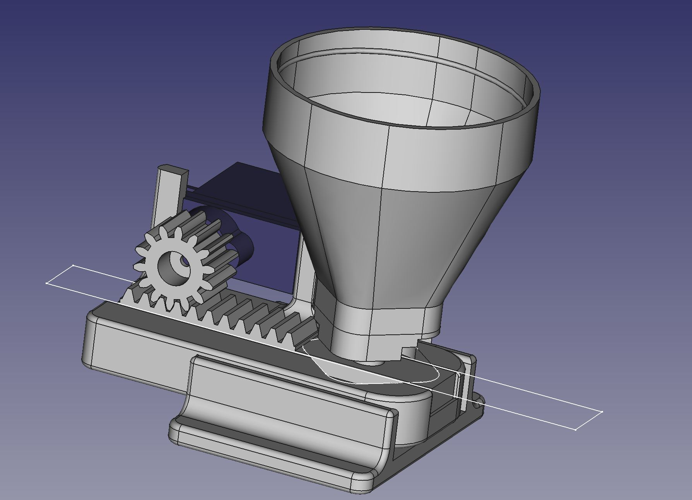
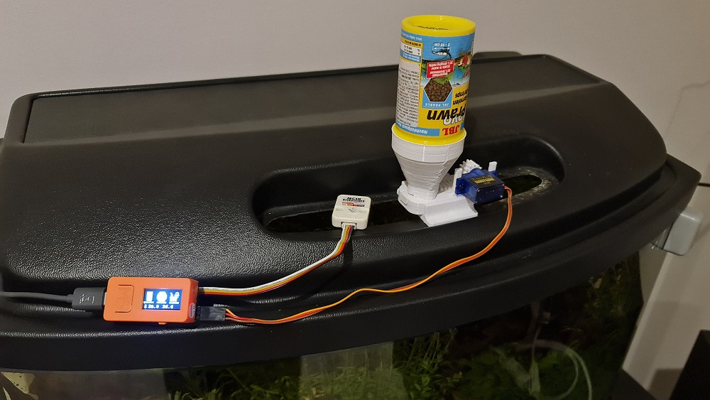
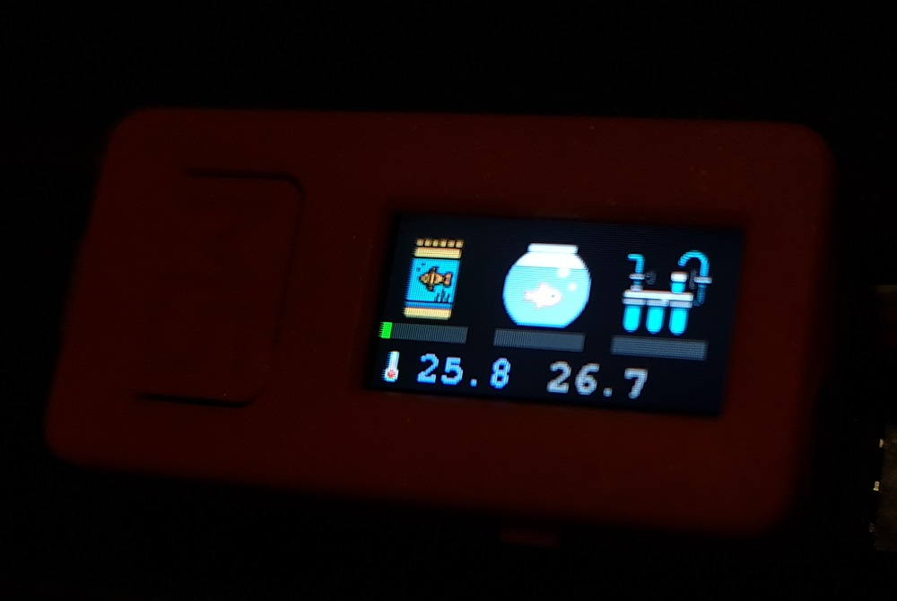
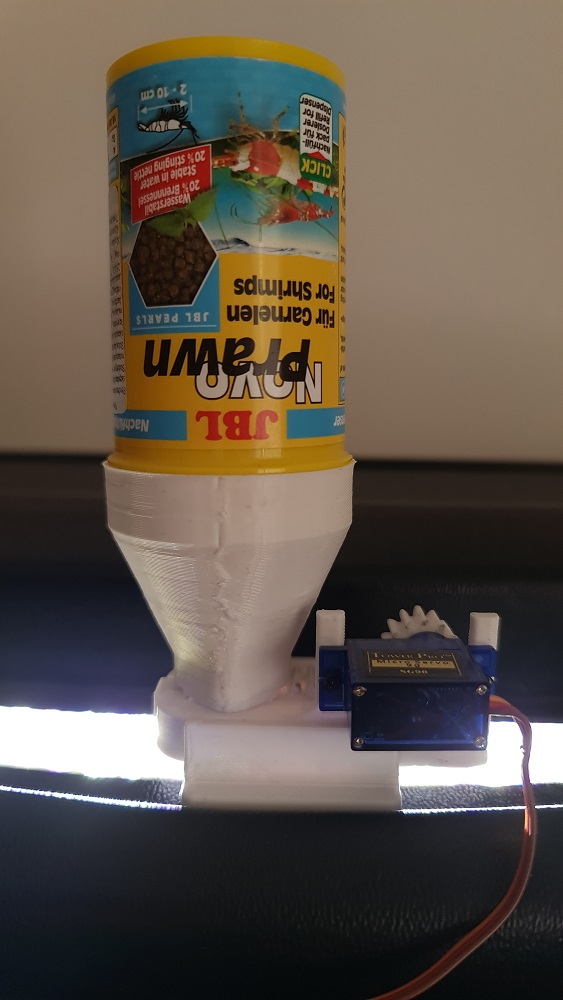

# FishFeeder

This is a really simple TinyGo project that relieaves certain worry when I travel and leave my aquarium unattended.
Coupled with a Raspberry Pi with a camera, Wireguard tunnel, a couple of simple (reverse) proxies I am able to remotely care for my 
aquatic critters!

## Design
At first I was thinking what kind of hardware to use and how to connect it to the Internet, however, I was really stoked on doing this project
using Go. So, ESP32 wifi capabilities were out the window until [this and related issues](https://github.com/tinygo-org/tinygo/issues/2024) are resolved.
Then I was thinking whether to design the hardware and solder it myself... And then one day I remembered, that I've got a couple of M5StickC modules lying around
without any interesting usecase.

Also, A few weeks ago, I created kind of a reminder using M5Stack Atom with experimental configurable Pomodoro timer and decided to expand on that.
I took the M5StickC, experimental Pomodoro timer code, refactored it a bit, fiddled with FreeCAD and vuola! Remote-capable fish automation unit is complete with minimal soldering effort!

I really really really wait for TinyGo to have native WiFi capability on these chips! (Maybe Espressif will help?) This way I would be able to connect a camera module, integrate Wireguard and stream video/pictures without Raspberry Pi!

## Features

- Three individually resettable timers:
  - Feeding
  - water changes
  - filter maintenance
- Nudges
- Dispense food using a cheap 9g server
- Reset feeding timer and feed the fish (configurable feeding pattern)
- M5Stack IR temperature sensor
- Remote feeding and status (via USB, serial)

## Build

You only need an Espressif IDF SDK and a proper version of `esptool.py` (on Windows it installs as esptool.py.exe which totally screws with the tooling for some reason, so I had to manually copy and rename the executable installed by pip). If your `esptool` is working and the M5StickC(or any ESP32 board for that matter!) is connected, you can run `go generate` and after brief compillation the firmware will be flashed.
